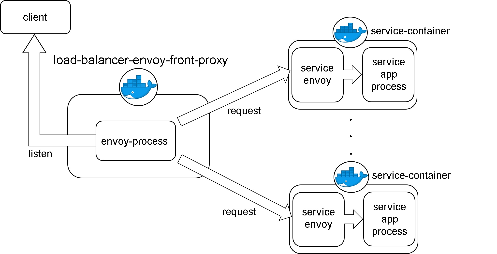

# load-balancer-envoy-front-proxy
load-balancer-envoy-front-proxyは、クライアントの要求に応じて、指定したサービスとのネットワーク通信を仲介します。

# 概要
load-balancer-envoy-front-proxyは、envoy proxyを利用したload-balancerです。(envoy: https://www.envoyproxy.io/)  
load-balancer-envoy-front-proxyは、クライアント側から要求を受取った際、指定したサービスとのネットワーク通信を仲介することで、各サービスコンテナ間との通信を可能にします。

# 動作環境
load-balancer-envoy-front-proxyは、kubernetes上での運用を前提としています。
```
- OS: Linux   
- Kubernetes

最低限スペック
- CPU: Intel64/AMD64/ARM64 2 core
- memory: 4 GB
```
# 起動方法
このリポジトリをクローンし、docker imageをbuildしてください。
```
$ cd /path/to/load-balancer-envoy-front-proxy  
$ bash docker-build.sh
```

# 環境変数  
| 環境変数名         | 設定値の例                  | 
| :---------------: | :-----------------------: | 
| REPOSITORY_PREFIX | "prefix"                  | 
| SERVICE_NAME      | "load_balancer_for_phone" | 


# システム構造
